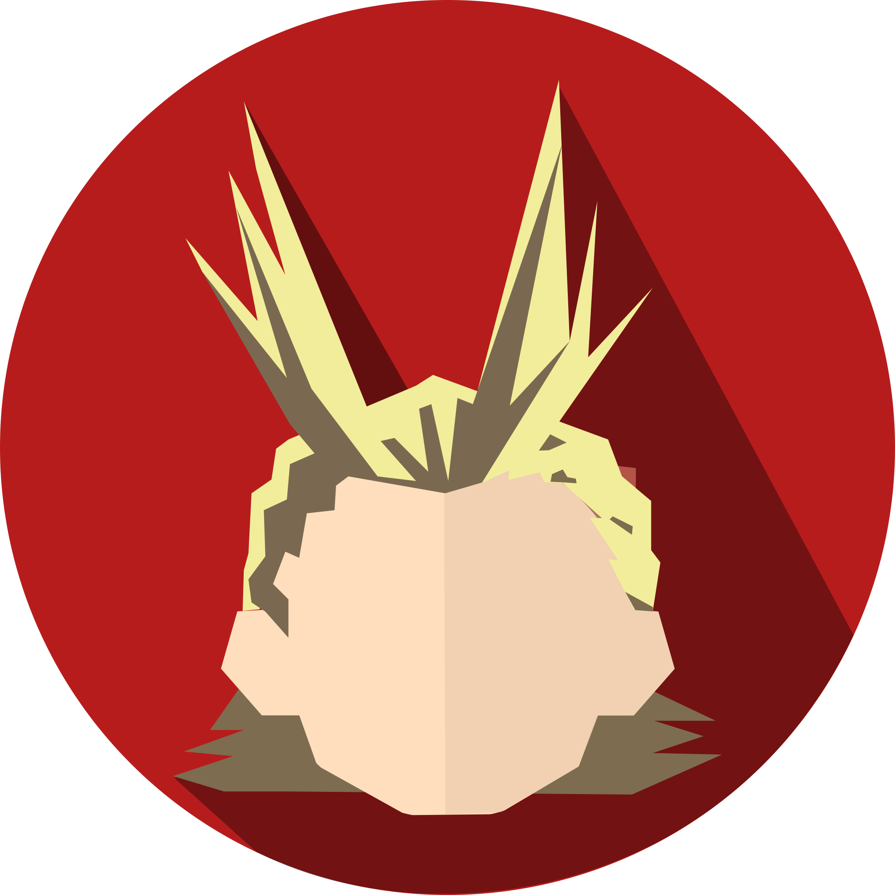
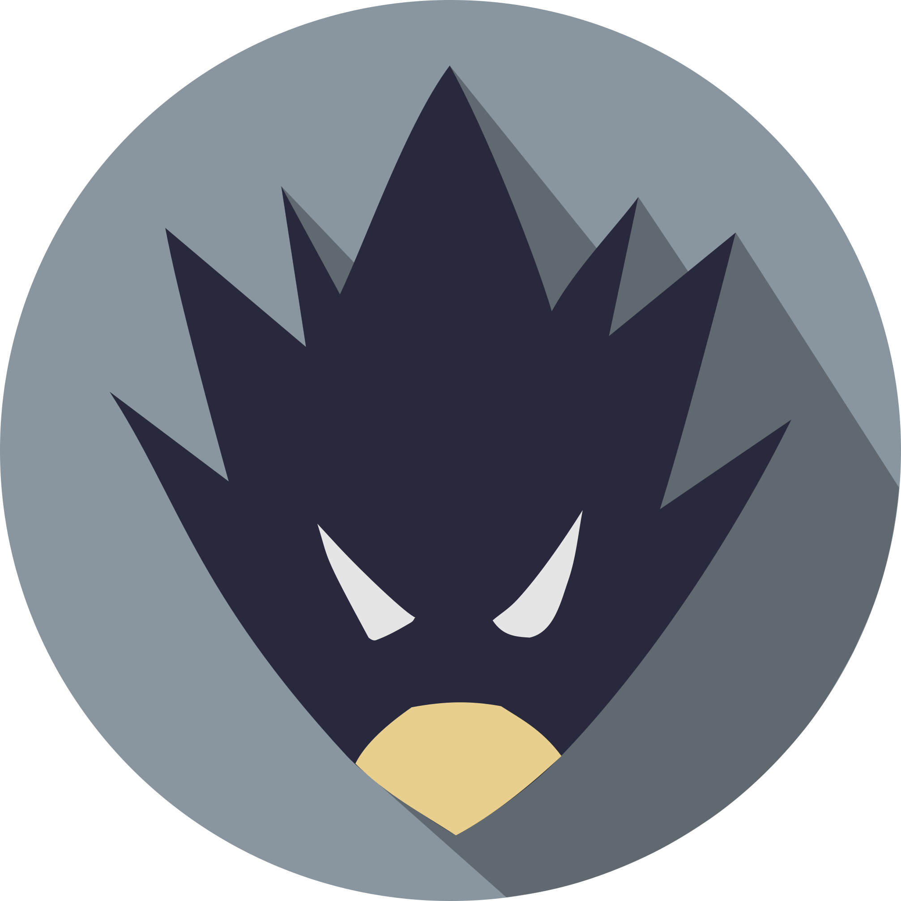

# I'm a Spoiler Bot

<div align = "center">
    <br>
    
    <br>
    <br>

[](https://saythanks.io/to/Fazendaaa)

[](.../../README.md)
[](./README_PT.md)

[](https://travis-ci.org/Fazendaaa/I-m-a-Spoiler-Bot)
[](https://codecov.io/gh/Fazendaaa/I-m-a-Spoiler-Bot)
[](https://www.codacy.com/app/Fazendaaa/I-m-a-Spoiler-Bot?utm_source=github.com&amp;utm_medium=referral&amp;utm_content=Fazendaaa/I-m-a-Spoiler-Bot&amp;utm_campaign=Badge_Grade)
[](https://codeclimate.com/github/Fazendaaa/I-m-a-Spoiler-Bot/master/package.json)
[](https://snyk.io/test/github/fazendaaa/podsearch_bot?targetFile=package.json)
[](https://codeclimate.com/github/Fazendaaa/I-m-a-Spoiler-Bot/maintainability)

</div>

> O bot feito para esconder os spoilers enviados.

## Sobre
Eu e uns amigos estávamos acostumados a utilizar um bot para enviar spoilers em um grupo de discussões de anime, mas tal bot parou de funcionar. Foi quando eu decidi fazer a minha versão de um bot assim, para podermos, desta maneira, continuar enviando conteúdos sensíveis sem afetar àqueles que ainda não leram o capítulo do mangá ou até mesmo viram o episódio do anime.

Você pode ver quantos spoilers foram enviados até agora aqui:


**obs**: todos os spoilers são armazenados por uma semana apenas!

### Aviso
Por padrão os comandos se encontram por em Inglês mas possuem seu equivalente em Português:
* [Inglês](../../others/locales/en.yaml)
* [Português](../../others/locales/pt.yaml)
* [Holandês](../../others/locales/nl.yaml)
* [Turco](../../others/locales/tr.yaml)
* [Espanhol](../../others/locales/es.yaml)
* [Italiano](../../others/locales/it.yaml)
* [Alemão](../../others/locales/de.yaml)
* [Francês](../../others/locales/fr.yaml)
* [Russo](../../others/locales/ru.yaml)
* [Chinês](../../others/locales/zh.yaml)
* [Japonês](../../others/locales/jp.yaml)

## Como utilizar?
Primeiro de tudo, abra uma conversa com o [@ispoilerbot](http://t.me/ispoilerbot).

**obs**: links são encurtados automaticamente.

## Sending Spoilers
Basicamente há dois tipos de spoilers, os de _leve_ peso, que não pedirão ao usuário permissão para serem mostrados, e os de **pesado** peso, que pedirão tais permissões.

O modo inline funciona em qualquer conversa:

```
@ispoilerbot spoiler a ser enviado como texto
```

Exemplo:

```
@ispoilerbot L morre!
```

<div align="center">
    
</div>

E você pode também enviar o spoiler nomeando ele:

```
@ispoilerbot spoiler a ser enviado como texto "nome do spoiler"
```

Example:

```
@ispoilerbot L morre! "Death Note"
```

<div align="center">
    
</div>

Spoilers pesados com:

<div align="center">
    
</div>

E aqueles spoilers sensuais com -- essa opção foi adicionada como uma maneira de evitar algum problema com as [politicas](https://www.businessinsider.com/apples-porn-policy-2013-1) da Apple caso atualizem ela:

<div align="center">
    
</div>

## Ajuda
Caso precise de mais informações, abra uma conversa com o bot e digite:

```
/help
```

# Como funciona?
Você pode construír um bot similar a este, eu escrevi um tutorial sobre isso no meu [Podesearch Bot](https://github.com/Fazendaaa/podsearch_bot), basta seguir os procedimentos citados em [BUILDING_PT.md](https://github.com/Fazendaaa/podsearch_bot/blob/master/docs/building/BUILDING_PT.md).

# Deployment
Esse bot está rodando no [Heroku](http://heroku.com/) através de integração direta do Github, isso significa que cada nova push para a branch ```master``` representa o código que está atualmente servindo de diretriz por bot. Você pode verificar mais como o bot está rodando através do arquivo [Procfile](https://github.com/Fazendaaa/I-m-a-Spoiler-Bot/blob/master/Procfile). Você também pode enviar uma cópia direta desse código para o Heroku através do seguinte botão:

[](https://heroku.com/deploy?template=https://github.com/Fazendaaa/I-m-a-Spoiler-Bot)

## Testando
Como há uma integração com o [Travis CI](http://travis-ci.org/) e [Codecov](https://codecov.io/). Os testes foram escritos com o [Jest](https://facebook.github.io/jest/).

```bash
npm test
```

Todos os códigos em [schedule](../../src/lib/schedule) não são testados porque são simplesmente "timers" para as outras açóes já implementadas e testadas. E aqueles na pasta [stats](../../src/lib/stats) também, mas porque servem apenas para calcular o número de spoilers enviados para ser usado na badge.

Se algum erro for reportado durante este processo relacionado com dependências utilizadas e você gostaria de ver como lidar com elas, leia mais em [Segurança](#Segurança).

# Segurança
Eu adicinei uma integração com [Snyk](https://snyk.io/) para garantir que todas as dependências utilizadas não tenham erros ou bugs não concertados antes da Integração Contínua (CI) para garantir o Desenvolvimento Contínuo (CD).

## Errors/Bugs em Dependência
Se o Snyk reportar algum error ou bugs que podem ser corrigidos, apenas siga os passos da ferramenta em como lidar com tais problemas -- para mais ajuda, leia a [documentação](https://github.com/snyk/snyk#cli) deles.

# Construído com
* [dotenv](https://github.com/motdotla/dotenv)
* [emoji-regex](https://github.com/mathiasbynens/emoji-regex)
* [mongoose](http://mongoosejs.com/)
* [node schedule](https://github.com/node-schedule/node-schedule)
* [telegraf](http://telegraf.js.org/#/)
* [telegraf-i18n](https://github.com/telegraf/telegraf-i18n)
* [telegraf-session-local](https://github.com/RealSpeaker/telegraf-session-local)
* [tiny-shortener](https://github.com/Fazendaaa/tiny-shortener)

# Código
[Typescript](http://typescriptlang.org/) puro e simples, além dos [padrões de linter da Microsoft](https://github.com/Microsoft/tslint-microsoft-contrib).

# Artes
Eu fiz todos os desenhos do bot, [Boku No Hero](http://bokunoheroacademia.wikia.com/wiki/My_Hero_Academia_Wiki) foi minha inspiração para.

<div align="center">
    <br>
    
    
    
    
    
    
    
    
    
    
    
</div>

Você pode ver mais na past [img](../../others/img).

# Contribuindo
Por favor, eu não sou nativo/fluente em Inglês, então se você ver uma variável escrita errada ou até mesmo um comentário que eu escrevi de maneira errada, me avise. Contribuições não necessariamente devem ser feitas através de código apenas, elas tem a ver com melhorar o que já está presente das mais diversas maneiras para que mais pessoas possam aprender sobre.

Caso seja o código ou não, você pode me ajudar lendo as diretrizes no arquivo [CONTRIBUTING_PT.md](../contributing/CONTRIBUTING_PT.md). 

# Controle de versão
Eu adoraria dizer que [SemVer](https://semver.org/) ou algo do tipo fora utilizado porém, em experiência pessoal, esse tipo de aborgaem não funciona muito bem comigo, o cara que pode comitar várias vezes esse projeto por duas semanas seguidas e passar um anos sem dar um simples ```npm update``` no projeto. Então, não se é utilizado sistemas de versionamento.

# A realizar
Como esse README estará sendo atualizado com as mudanças importantes, não pretendo utilizar nenhum histórico de atualizações de bugs corrigidos ou novas funcionalidades. Todavia, você pode ter uma noção do que virá e o que está sob análise na aba de [Projects](ttps://github.com/Fazendaaa/I-m-a-Spoiler-Bot/projects/) -- aviso: o conteúdo se encontra em Inglês.

# Autores
* Apenas [eu](https://github.com/Fazendaaa) até agora.

Considere me comprar um café:

[](https://www.buymeacoffee.com/Fazenda)

Ou até mesmo se tornar um padrinho:

[](https://www.patreon.com/Fazenda/overview)

Estou analisando a possibilidade de se colocar [PicPay](https://www.picpay.com/site/) e [Padrim](https://www.padrim.com.br/) -- já que são opções muito utilizadas no Brasil.

# Licença
Assim como muitos projetos de código livre, a licença MIT é utilizada aqui. Mais sobre em [LICENSE](../../LICENSE).
